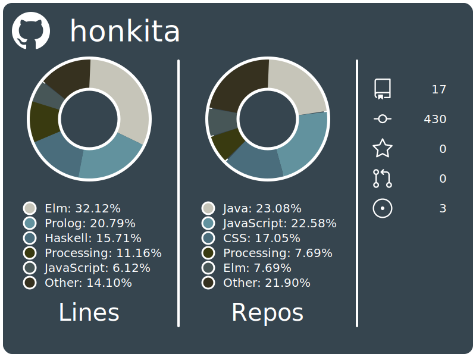

[](https://github.com/honkita) [](https://elitelu.com) [](https://www.linkedin.com/in/elitelu/)

# GitHub Stats (Elite's version)


> [!IMPORTANT]
> Because of GitHub's rate limit, it is advised to fork this project and deploy on Vercel or a similar platform. Along with this, generating a personal access token is mandatory because without one, the max number of requests per hour is 50 and private repositories CAN NOT be accessed. While there is caching for users that refreshes every 1-5 minutes, it is still recommended.

## Display Information



| Item          | Description                                                                                                                                                                                          |
| ------------- | ---------------------------------------------------------------------------------------------------------------------------------------------------------------------------------------------------- |
| Lines         | Displays graphically the number of lines coded with a given language and displays the user's top languages.                                                                                          |
| Repos         | Displays graphically the percentage of repos coded with a given language and displays the user's top languages.                                                                                      |
| Miscellaneous | Displays the following information from top to bottom: <ul><li>Number of Repos</li><li>Number of Commits</li><li>Number of Stars</li><li>Number of Fetch Requests</li><li>Number of Issues</li></ul> |

## How to use

### Basic

Replace **GITHUB_USERNAME** with your username on GitHub.

```
[](https://github.com/honkita/GitHub-Stats-Backend)
```

That's it!

### Additional parameters

| Parameter | Type    | Description                                                                                                                                                                   |
| --------- | ------- | ----------------------------------------------------------------------------------------------------------------------------------------------------------------------------- |
| limit     | Integer | Denotes the **max** number of unique languages that can be displayed. The default/absolute max value is 5. If there are more languages, they will be grouped under **Other**. |
| colour    | String  | Denotes the theme of the colours used for the display.                                                                                                                        |

A code snippet example with the limit set as **3** and the colour theme set as **reds** is as follows:

```
[](https://github.com/honkita/GitHub-Stats-Backend)
```

#### Colour Themes

> [!Note]
> Currently, there are only two themes. More themes will be implemented soon.

##### default

[](https://github.com/honkita/GitHub-Stats-Backend)

##### reds

[](https://github.com/honkita/GitHub-Stats-Backend)

## Forking and Deploying on Your Own

Before forking and deploying, please generate a Personal Access Token (PAT) on GitHub. This can be done by heading to **Settings**, then **Developer Settings**. Under **Developer Settings**, select **Personal Access Token** and select **Tokens (classic)**. Generate a new classic token. I set the expiration of my token to **No Expiration**. The scopes that must be enabled are as follows:

- repo
- user
- read:project

Do **NOT** enable any admin scopes. Once generated, copy the token.

> [!IMPORTANT]
> Do not close the page until you have copied the token. The page with the token value will NOT be viewable!

> [!CAUTION]
> Do not share the token with anyone. This token will only be used in one other place, which is on the deployment platform's environment variables section.

The deployment platform that is used for this project is [Vercel](https://vercel.com) Deploy the site as you would with any repository from GitHub. Upon doing so, change the environment variables. Create a variable called **GHTOKEN** and set the value as the PAT. Upon doing so, use as follows, replacing **INSERT_URL_HERE** with the new URL from the deployment platform:

```
[](https://github.com/honkita/GitHub-Stats-Backend)
```
